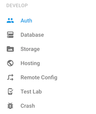
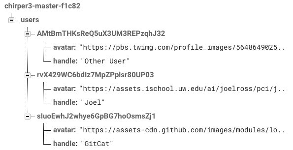
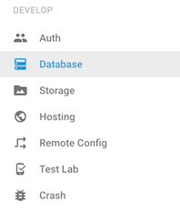
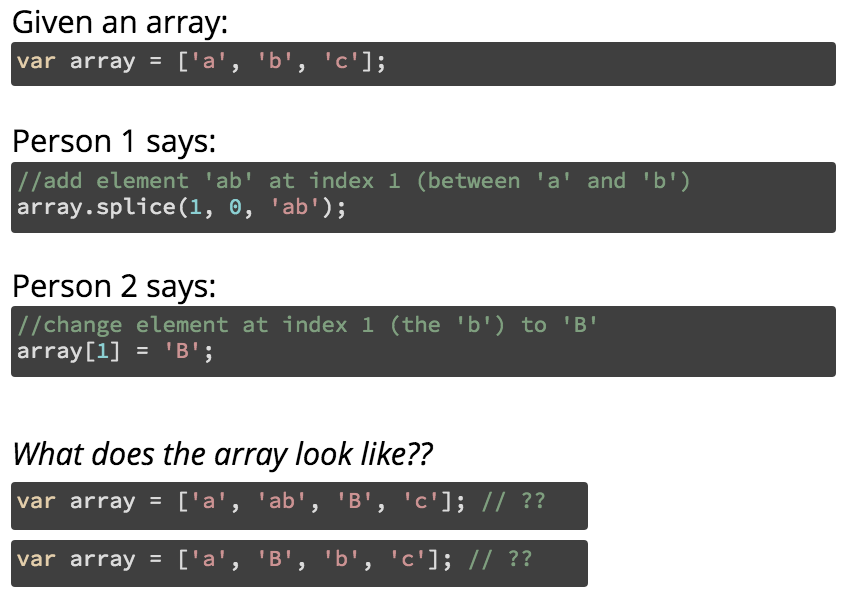

# Firebase Tutorial
This repository contains starter code for creating a Twitter clone called **Chirper** as a tutorial for learning the [Firebase](https://firebase.google.com/) library. Follow the below steps, reading the instructions carefully for explanations about how to use this library to do user authentication and save data in the cloud!

## What is Firebase?
[**Firebase**](https://firebase.google.com/) is a web service that provides tools and infrastructure for use in creating web and mobile apps that store data online in the cloud (a "web backend solution"). In effect, Firebase acts as a _server_ that can host information for us, so that we can just build client-side applications without needing to program a web server.

In particular, you can think of Firebase as a **"giant JSON Object in the Cloud"**&mdash;you can  refer to this object as a variable in your code, changing it in your JavaScript and have the changes easily be reflected in the cloud and on other client computers viewing the same web page. This let's you create a data binding between clients and the server, so that if you update data on one machine, that change automatically appears on the other. Real-time updates!

- When combined with Angular, Firebase can be used to provide _three-way data binding_: not only is data bound and kept consistent between the view (HTML expressions) and model (JavaScript `$scope`), but that data can _also_ be kept consistent with the cloud.

    Firebase is owned and maintained by Google&mdash;just like Angular&mdash;so they integrate together easily.

In addition, the Firebase service offers a client-side based system for performing **user authentication**, or allowing users to "sign in" to your application and have particular information associated with them. It's possible to have users sign up with an email and password, or even using an external service (e.g., "sign up with Facebook"). Firebase provides all those extra details like being able to reset passwords. And this is all performed securely from the client-side, without the need to set up an additional server to perform OAuth work.

These features mean that Firebase can be a go-to back-end for producing a client-side app that involves persisted data (like user accounts). And its [free service tier](https://firebase.google.com/pricing/) is perfectly suited for any development app.

- _Important note_: Firebase updated to version 3.0 in **May** (2 months ago). This was a massive revision to the API, so watch out for "legacy" examples.

## What You'll Do
We've got a couple hours, so let's build Twitter. 


By following this tutorial, you'll create **Chirper**: a simple social networking system that allows users to post "chirps" which can be seen by all other signed in users. Users can even like (heart) the chirps!

Additionally, in order to make this site even _better_ than that other bird-based network, it will include the "ChirpPad", a "shared notepad" where users can collaboratively type out and edit messages, similar to what you can do in Google Docs or with [Etherpad](http://etherpad.org/).

The app will thus include the following components:

1. User sign-up and authentication
2. User-specific data (usernames and avatar pictures)
3. Shared data for the ChirpPad
4. The ability to post new chirps
5. Liking existing chirps

**I recommend you work with a partner** (on two machines, but with the same service). It's much more fun when you have multiple people chirping at each other!

### Resources

- [Firebase Web Guide](https://firebase.google.com/docs/web/setup)
- [Firebase Realtime Database Guide](https://firebase.google.com/docs/database/web/start)
- [AngularFire Guide](https://github.com/firebase/angularfire/tree/master/docs/guide)

## Firebase Setup
Setting up firebase involves a number of steps:

1. **Sign up for the service** You will need to sign up for the Firebase service to use it, though you can sign in with your UW email if you've set it up as a Google account.

    Visit [https://firebase.google.com/](https://firebase.google.com/) and click the "Get Started for Free" button. Sign in with your Google Account.
    
2. **Create a Firebase App** You need to create a new project (per application) for the Chirper app you're building. Click the "Create New Project" button to do so.

    In the pop-up window that appears, you'll need to give the app a unique name. Try `chirper-your-uw-id`.
 
3. After you create the project, you will be taken to the **Console** for your project. This is a web page where you will be able to manage the configuration of your project, as well as view and even modify the "JSON-Object-in-the-Cloud" for your data.

    Navigation menus are on the left-hand side; we will be using some of these tabs as we go.
    
4. **Add Firebase to Web Page** Now you'll need to add the Firebase library to your web page, as well as some configuration data to make sure your page connects to the App you just created.

    Click on the "Add Firebase to your web app" button. This will provide you some HTML code for loading the Firebase library, as well as an inline `<script>` that configures your app to use Firebase. **Copy and paste** this code into your `index.html` file _above_ the `app.js` script!

5. **Add the AngularFire library** In addition, you'll also need to include an _additional_ library called [AngularFire](https://github.com/firebase/angularfire) This official library provides integration between Angular and Firebase, allowing us to do three-way data binding and just overall making the Firebase API easier to use (particularly for user authentication!)

    Recall the steps to using an Angular library:
    
    1. Include the [AngularFire](https://github.com/firebase/angularfire/blob/master/docs/quickstart.md#2-add-script-dependencies) script _below_ the Firebase library but _above_ your `app.js` file. Be careful not to include the Firebase library twice!

    2. [Inject the module](https://github.com/firebase/angularfire/blob/master/docs/quickstart.md#4-inject-the-angularfire-services) into your Angular app. Note that this module provides a couple of _services_ we inject into our controller, but we'll go over those as needed.


Make sure to open the web page (from a local webserver) and check the developer console for errors to make sure everything is set up and integrated correctly. You won't see much to begin with.

## User Authentication
We'll start by enabling user authentication: allowing users to sign up for and log into Chirper.

1. **Enable authentication in Firebase** First you'll need to set up your Firebase App (in the cloud) to support user authentication. On the Firebase Console web page, click on the "Auth" tab in the side-bar on the left:

    

    Then under "Sign-In Method" tab (at the top), you'll need to select the **"Email/Password"** object and **Enable** it. This turns on Firebase's ability to manage users by authentication them through an email and password

2. **Include the sign-up form** Next we want to show the sign-up form on the web page. This is defined in a _partial_ `partials/signup-form.html`. While we could set up a routing system to display this partial, a simpler solution is to use the [`ng-include`](https://docs.angularjs.org/api/ng/directive/ngInclude) directive to have Angular load the partial at a particular place. We tend to put this directive on a `<div>`:

    ```html
    <div ng-include="path/to/partial.html"></div>
    ```

    Use this directive to load the sign-up form inside the `<main>` element. When you refresh the web page, you should now see the sign-up form.

3. **Bind models to form inputs** As practice (and to make sure you're aware of the model names), edit the `signup-form.html` partial so that each of the 4 `<input>` elements has a model bound to it (using the `ng-model` directive). The comments in the HTML indicate suggested names for the models.

    - Also take note that the form includes displayed validation errors that are specific to the validation that is failed (e.g., if the password is missing or just too short). This is done by referring to the input's `$error` property. This is a good example for how your Testing Challenge form should work!

4. **The `$firebaseAuth` service** In order to perform authentication, you will use an AngularFire service that provides helper methods for doing authentication tasks. This service is called `$firebaseAuth`, and you will need to **inject** it into your _controller_ (remember to include it twice!):

    ```javascript
    app.controller('ChirperCtrl', ['$scope', '$firebaseAuth', function($scope, $firebaseAuth){
      //...
    
    }]);
    ```
    
    - Note that ___all___ work for this tutorial will occur inside this one controller, for simplicity.
    
    In order to actually setup the authentication, we need to call this service _as a function_. The result of that function will then be an "authenticator" object that we can call methods on to do user sign-up and such:
    
    ```js
    //name as Auth because it's like a class!
    var Auth = $firebaseAuth();
    ```

5. **Get form submission data** In your controller, create a function _on the scope_ called `signUp()` which will be called when the user clicks the "Sign Up" button on the form (notice the `ng-click`?). In this function, try logging out the models for `email` and `password` (which are on the `$scope`), to make sure that you can read them from the form. What happens?

    - **IMPORTANT TIP** You don't need to come up with real email addresses for testing. Try using `a@a.com`, `b@a.com`, `c@a.com`, etc. Similarly, `password` works fine for testing passwords (though you should never do that in real life!)

        You can also view all the users you create on the Firebase Web Console (under Auth > Users).

    Many directives (such as `ng-nclude` and `ng-if`) create what is called a new [child scope](https://docs.angularjs.org/guide/scope). Variables in the outside (parent) `$scope` are accessible inside the child, but variables added inside the child scope will not be accessible outside of it. This is just like how scoping works in Java:
    
    ```java
    int outside = 1;   
    if(...) {
      int inside = 2;  
      //inside AND outside accessible here

      outside = 3; //can change outside scope
    }
    
    //only outside accessible here
    System.out.println(outside);
    ```  
    
    This means that because the input models (which were created with the `ng-model` directives you added) are defined inside the partial inside the `ng-include` child scope, they are not available to the controller itself, causing things like `$scope.email` to be undefined. (See also [this example](http://jimhoskins.com/2012/12/14/nested-scopes-in-angularjs.html)).
    
    The best way to fix this is to do what the above Java example does: declare a variable at the "parent" scope, and then modify that variable in the child scope so that the changed version can be used from the parent.
    
    In the JavaScript (before the `signUp()` function), declare a new variable on the (parent) scope:
    
    ```js
    $scope.newUser = {}; //empty object to start
    ```

    Then have the models declared on the `<input>` elements in the HTML instead be bound to _properties_ of this object:
    
    ```html
    <input name="email" ng-model="newUser.email">
    ```
    
    Modify **all 4** of the input models to instead refer to properties of this object. Now you should be able to log out the values of `$scope.newUser.email` and `$scope.newUser.password` when the form is submitted and see correct values!

6. **Create user** Finally, we can actually go ahead and create a user. Use the method [`Auth.$createUserWithEmailAndPassword()`](https://github.com/firebase/angularfire/blob/master/docs/reference.md#createuserwithemailandpasswordemail-password), passing it the email and password from the form. This will create a new user account in Firebase (you can view it in the Web Console), as well as log in the user.

    This method returns a _Promise_, so you should use the `.then()` method to do further work after the user is created (e.g., logging that they have been created):
    
    ```js
    Auth.$createUserWithEmailAndPassword($scope.newUser.email, $scope.newUser.password)
        .then(function(firebaseUser) {
           console.log('user created: '+firebaseUser.uid);
        })
        .catch(function(error) { //report any errors
           console.log(error);
        });
    ```

    The Promise callback is passed a "firebaseUser" object, which contains data about the user who has just been created and signed in. The most important property of this object is the **`firebaseUser.uid`**, which is the _unique id_ of that user generated by Firebase. This is like the "internal codename" for users that we'll use to keep track of them.

7. **Display login views**

    In fact, you can use this `uid` to keep track of which user is signed in. Assign that `uid` to a new model on the scope (e.g., `$scope.userId = firebaseUser.uid;`), and when you sign up on the page you should now see a "Logout" button (that is displayed only `ng-if` that variable is defined).
    
    Along similar lines, go to the `index.html` file and add a directive (e.g., [`ng-show`](https://docs.angularjs.org/api/ng/directive/ngShow)) to your `ng-include` div so that it only shows when there is _not_ a `userId` variable defined (`!userId`).
    
    Also add a _second_ <div> that uses `ng-include` to show the `partials/main.html` partial (which is the main Chirper page). This partial should only show when the user is signed in!

8. **Handle authentication events**

    It would be nice to stop having to create a new user every time you wanted to test something, and for the page to remember when someone is signed in. To do this, we want to generalize the problem: whenever something changes (e.g., the page loads, or someone signs in or out), we want to "update" our `$scope.userId` variable. We can respond to this _whenever_ by using an event-handler&mdash; similar to how we've dealt with click events, mouseenter events, etc. 
    
    AngularFire provides an event handler called [`$onAuthStateChanged`](https://github.com/firebase/angularfire/blob/master/docs/reference.md#onauthstatechangedcallback-context) for whenever the "authorization state" changes: so whenever someone signs in or out. We can pass this event listener a callback which will assign our `userId` when some signs in, or "unassign" (make it undefined) it when someone signs out:
    
    ```js
    Auth.$onAuthStateChanged(function(firebaseUser) {
	   if(firebaseUser){
	      console.log('logged in');
	      //assign firebaseUser.uid to $scope.userId
	   }
	   else {
		  console.log('logged out');
		  //assign undefined to $scope.userId
	   }
    });
    ```

    Be sure and do this _outside_ of your `signUp()` function (we want to register this listener all the time, not just when they hit the button).

9. **Signing Out and Signing In** As a last step for authentication, we want to make sure the "Sign Out" buttons and "Sign In" buttons work (the "Sign In" button will sign in an existing user given the email and password). I've provided you examples to save time.

    ```js
   	//respond to "Sign Out" button
   	$scope.signOut = function() {
	   Auth.$signOut(); //AngularFire method
	};
	
	//respond to "Sign In" button
    $scope.signIn = function() {
	   Auth.$signInWithEmailAndPassword($scope.newUser.email, $scope.newUser.password); //AngularFire method
	};
    ``` 

## User-Specific Data
Now that you can sign people in and out, we want to also be able to save user-specific information (e.g., their Handle and Avatar picture). To do this, we're going to save those variables in Firebase's "JSON Object in the Cloud" (JOITC), also known as the [realtime database](https://firebase.google.com/docs/database/web/start). We're going to produce a JSON object that has the following structure:

```json
{
  "users" : {
    "user-id-hash-1" : {
      "avatar" : "https://assets.ischool.uw.edu/ai/joelross/pci/joelross-1...",
      "handle" : "Joel"
    },
    "user-id-hash-2" : {
      "avatar" : ""https://pbs.twimg.com/profile_images/564864902561415168...",
      "handle" : "Other User"
    },
    ...
  }
}
```

That is, the "JSON Object in the Cloud" will have a key `users` that refers to an object. That `users` object will have keys that correspond with the Firebase generated user ids (the `firebaseUser.uid` variable you've worked with), with a value for each key that is yet _another_ object containing the `handle` and `avatar` keys. Thus we would be able to refer to someone's handle as: `chirperDatabase.users[userId].handle`.

In Firebase, this will look something like:



### Security Rules
Because Firebase is just a giant JSON object in the cloud and is usable from a client-side system, technically _anyone_ can access it. Each element of the JSON object is accessible through a particular URI (e.g., `https://chirper-myname.firebaseio.com/users/user-id-hash-1/handle`); all we'll do from our code is send AJAX requests (via AngularFire) to `GET` and `POST` to this resource.

In order to keep information from being 100% publicly available, Firebase lets you define [security rules](https://firebase.google.com/docs/database/security/) that specify what users can access which elements. For example, we can make it so that only authenticated users can modify their handle or avatar. These rules are defined using a JavaScript-like syntax, and can be quite complex if you want to include very specific forms of access control. We'll just include enough basic rules to get us starter, but you are encouraged to read through the documentation for more details (e.g., for your final projects!)

In order to set up the security rules, you need to go to the Realtime Database in the Firebase Web Console:



This is where you can see the "JSON Object in the Cloud" as it currently exists.

Click on the "Rules" tab at the top and replace the content with the following:

```json
{
  "rules": {
	".read": true,
  	"users": {
      "$uid": {
        ".write": "auth.uid === $uid"
      }
    }
  }
}
```

This specifies that _all_ elements are readable by everyone (which means that you can see all the data without logging in. Note that emails and passwords are not stored in this JSON object!). Then inside the `users` element, the element with the `uid` key can only be _written_ (modified) by a user who has been authenticated and has that same `uid`.

Be sure and hit "Publish" to save your changes!

- These examples are taken from the [quickstart guide](https://firebase.google.com/docs/database/security/quickstart#sample-rules), which has a good set of sample rules to start with.

### Accessing Data
Now we can add code to our controller to start interacting with the JOITC database.

1. **Get reference to the database** In order to interact with the database from our JavaScript code, we need to have a variable which _references_ that JSON object. The Firebase library that you included at the start of the tutorial includes methods that let us create these references:

    ```js
    //get reference to the "root" of the database: the containing JSON
    var baseRef = firebase.database().ref();
    ```

    We can get elements "inside" this object by using the `child()` method. For example:
    
    ```js
    var usersRef = baseRef.child('users'); //refers to "users" value
    ```

    This method will create a new key/value in the JSON object if it doesn't exist

2. **Save the user data** Now that we have a reference to the "users" value in the JOITC, we can save the user's avatar and handle when we first create a user.

    Inside the `signUp()` function, _after_ you've created the user (in the `.then()`, create a new local variable (_not_ on scope) called `userData`, which is an object with a key `handle` and a key `avatar`. Assign the `$scope.newUser.handle` and `$scope.newUser.avatar` models from the form to this object.
    
    You will then need to create a new child node in the JOITC "users" value which has a key of the user's id. Then use the `set` method to assign some data to that new key (which you have access to because the rule we wrote said so!)
    
    ```js
    var newUserRef = usersRef.child(firebaseUser.uid);
    newUserRef.set(userData); //set the key's value to be the object you created
    ```
    
    You can create a new user and then check the Firebase Web Console to see that the user now has data stored!

### Displaying Data
But now that we've saved data in the cloud, we want to display it in the _view_ as well. That is, we want to **bind** the cloud data to a model (on `$scope`), which can then be bound to the view element, automatically showing whatever data is currently in the cloud!

   
1. **The `$firebaseObject` service** [AngularFire lets us perform this kind of binding](https://github.com/firebase/angularfire/blob/master/docs/guide/synchronized-objects.md) to an object using the [`$firebaseObject`](https://github.com/firebase/angularfire/blob/master/docs/reference.md#firebaseobject) service. You will need to **inject** this service into your _controller_ along with `$firebaseAuth` (remember to include it twice!)

    We then perform the binding between the JOITC data and the `$scope` model by calling this service as a method, passing it the JOITC reference we're interested in, and assigning the result to the `$scope` model:
    
    ```js
    //assign the "users" value to $scope.users
    $scope.users = $firebaseObject(usersRef);
    ```
    
    Now any changes made to the cloud data will be reflected in the `$scope.users` model.
    
    - Note that this is just 1-way binding: any changes we make to the model are not automatically saved to the cloud.

2. **Render the model** Now we can show this data on the page. In the `index.html` file, next to the "Sign Out" button there is a `<span>` that contains the word "Handle". Replace this text with an expression that shows the handle of the current logged-in user:

    ```
    {{users[userId].handle}}
    ``` 

    - Note that this process has already been applied to the `main.html` partial to show the user's picture in the chirping form.

    **Try changing the handle in the Firebase Web Console** (just click on the element you want to change in the "Data" tab and change it! Hit "enter" to save). You should see the changes to the handle applied to your signed-in user automatically!


## Two-Way Binding
By default, a `$firebaseObject` only provide "1-way" data binding: changes made to the cloud update the model, but changes to the model do not update the cloud. But we can use a method called [`$bindTo`](https://github.com/firebase/angularfire/blob/master/docs/reference.md#bindtoscope-varname) to make this into a "2-way" binding: where changes to the model will automatically update the cloud as well.

We will demonstrate this by making the "ChirpPad" a shared data variable.

1. **Modify the security rules** In order to let clients save data to the cloud, we need to add a security rule. In the Firebase Web Console, add the following object (inside the "rules"  key):

    ```json
    "chirppad": {
      ".write":"auth != null"
    },
    ```

    This will allow _any_ authenticated user to write to the "chirppad" key.

2. **Add a model for the textarea** At the top of the `main.html` file, there is a div for the  "ChirpPad", which contains a `<textarea>` that the user can type into. Add a model (using `ng-model` to this input.

    **IMPORTANT** Because this input is again being loaded in a _child scope_ (like the sign-up form), you need to create an empty object in the parent scope (e.g., `$scope.chirppad = {}`) and then have this input bind to a property of that object (e.g., `ng-model="chirppad.text"`).

3. **Create a `$firebaseObject`** In your JavaScript, create a reference to this `chirppad` key in the JOITC, and wrap it in a `$firebaseObject` to produce the 1-way data binding:

    ```js
	var padRef = baseRef.child('chirppad');
	var chirpPadObj = $firebaseObject(padRef);  
    ```

4. **Bind the database object to the model** Finally, we can use the `$bindTo()` method to specify that the `$firebaseObject` you just defined should take any changes to the model on the current `$scope` and use that to update the "chirppad" key in the cloud:

    ```js
    chirpPadObj.$bindTo($scope, "chirppad");
    ```

Now you should be able to type into the ChirpPad and see the results automatically reflected in the cloud! Try opening up a second browser to view your page (Incognito Mode is useful here) and watch one browser's typing show up in the other!


## Posting Chirps
Having gotten the hang of Firebase (I hope!), we can now actually let the user be able to post new messages (chirps)!

1. **Modify the security rules** Yet again, we need to add a security rule. In the Firebase Web Console, add the following object (inside the "rules"  key):

    ```json
    "chirps": {
      ".write":"auth != null"
    },
    ```

    This will allow _any_ authenticated user to write to the "chirps" key, which we'll use to store an **array** of Chirps.

2. **Get a reference to the "chirps" key** Just as you did before with the "users" and "chirppad" keys, get a firebase _reference_ to the `'chirps'` key in the JSON Object in the Cloud.

3. **The `$firebaseArray` service**
We're going to want to save Chirps as an **array** of Objects (_think about why!_). While an array is technically an object, [AngularFire provides a special service](https://github.com/firebase/angularfire/blob/master/docs/guide/synchronized-arrays.md#modifying-the-synchronized-array) to do 2-way binding for arrays called `$firebaseArray`. This service means that we can modify the array **concurrently** (at the same time) from multiple computers, without any errors occurring or data being lost depending on which person happened to "win the race" and get their change in first:

    

    The `$firebaseArray` service works like the `$firebaseObject` service, except we can use its special "concurrency-safe" methods to make sure our changes are not lost because someone beat us in a [race condition](https://en.wikipedia.org/wiki/Race_condition#Networking).
    
    You will need to **inject** the `$firebaseArray` service into your controller, along-side the `$firebaseAuth` and `$firebaseObject` services.

4. **Create a `$firebaseArray` object** We then call `$firebaseArray()` on a reference and bind it to the `$scope`, just like we did with the "users" object:

    ```js
	$scope.chirps = $firebaseArray(chirpsRef)
    ```

5. **Access the post form** Yet again, because the chirping form is defined in a child scope (partial), we need to create an object in the parent scope that the form's model can be assigned to:

    ```js
    $scope.newChirp = {};
    ```

6. **Handle post submission** Add a function called `postChirp()` to the `$scope` that can be called when the "Share" button is clicked. This function should declare a local (non-scope) variable called `chirpData` with the following properties:

    ```
    {
        text: the text in textarea (think about the model name!),
        userId: the current userId
        likes: 0
        time: firebase.database.ServerValue.TIMESTAMP        
    }
    ```
    
    (that last `time` value is a special value that refers to whatever time is on the Firebase server when the data is processed; this is the best way of saving an accurate timestamp with Fireabse).

    Log out this object to confirm that all the data looks correct.

7. **Add the data to the cloud array** Now that we have the data, we can add it to the `$firebaseArray` object (which is bound to the JOITC). But we're not going to use the `.push()` method like normal (because that is not concurrency-safe). Instead, we'll use the `$add()` method:

    ```js
    $scope.chirps.$add(chirpData)
    ```
    
    This method returns a Promise, so you can call `.then()` on it. After the promise has resolved (and the chirp is added). You should clear out the text in the post form (e.g., assign a value of `''` to it).

You should now see new Chirps show up on the page, and on multiple browsers as different people post!

- Note that there is just some simple Angular to show the contents of the `$scope.chirps` array using an `ng-repeat`. I've provided it for you so that the payoff comes faster :)


## Liking Chirps
Finally, you can add yet another method to respond to when the "like" (heart) button is pressed:

```js
//Make a function called "like() which is called when the button is pressed
//Note this function is passed in the chirp itself

   //Change a property (likes) of that chirp appropriately

   //Call .$save() on your chirps array, passing in
   //which chirp needs to be updated
```

(The [`$save()`](https://github.com/firebase/angularfire/blob/master/docs/reference.md#saverecordorindex) is used to update elements in the array).

- Yes, it is possible to like the same chirp more than once. Fixing this would involve saving an array of people who liked a particular chirp (or saving a list of chirps a user liked), and then doing some work with that. You're welcome to take a shot at adding this functionality if you have time!

## Deploying Your App
One last step: the best way to play with this system and enjoy the fruits of your labor is to let multiple people from multiple computers interact with it. That means it needs to be hosted on a web server somewhere.

While you can upload it to your student web server, there is an easier way. GitHub provides the ability to turn _any_ repository [into a webpage](https://help.github.com/articles/creating-project-pages-manually/): it will simple serve the `index.html` file out of the repository! (This is how the course website is currently hosted).

You can turn a repo into an deployed app by pushing your changes to a [separate branch](https://www.atlassian.com/git/tutorials/using-branches) (not `master`) called `gh-pages`:

```bash
git push origin gh-pages
```
    
(remember to `add` and `commit` your code first!)

This will then give you a webpage at

```
https://<username>.github.io/<reponame>
```

Put your Chirper online and have other people send you messages! Because now you know how to use Firebase!

